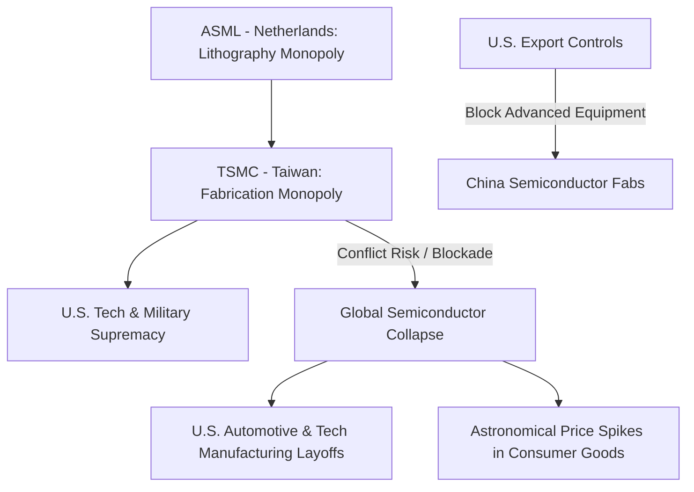

# Economic & Security Choke Points: Semiconductors, Straits, and Canals on the Domestic Frontline

This analysis evaluates the critical bottlenecks of the global economy: technological choke points (specifically advanced semiconductors and lithography) and maritime choke points (crucial straits and canals). Moving past standard rhetoric of "securing the global commons," we examine the hidden realpolitik motivators behind these strategic nodes and detail their direct impacts on middle-class American jobs, inflation, and public tax burdens.

---

## 1. Technological Choke Point: The Semiconductor War

Microchips are the "new oil" of the 21st century—the foundation of artificial intelligence, cloud computing, automated industries, and advanced military hardware. Control over the production and distribution of semiconductors is the ultimate lever of geopolitical influence.

### The Taiwan Monopoly and the "Silicon Shield"
*   **The Bottleneck:** TSMC (Taiwan Semiconductor Manufacturing Company) fabricates over 90% of the world's most advanced microchips (nodes under 5 nanometers). These chips are essential for everything from Apple iPhones to F-35 fighter jets.
*   **The Hidden Motivator:** Taiwan views its semiconductor dominance as a "Silicon Shield" that guarantees U.S. military defense. For Washington, preventing a Chinese takeover of Taiwan is driven by the realist necessity to deny Beijing control over the world's digital engine. If China captured TSMC intact, it could immediately dictate terms to the global economy and cut off the hardware required for the U.S. defense-industrial complex.
*   **Lithography Containment:** The U.S. utilizes its intellectual property laws to force the Dutch company ASML (which holds a monopoly on Extreme Ultraviolet [EUV] lithography machines) and Japanese firms to block the export of advanced chip-making equipment to China. The goal is to freeze China's semiconductor capabilities at least two generations behind the West.

### The CHIPS Act: Reshoring and Corporate Welfare
*   **Strategy:** The U.S. CHIPS and Science Act allocated $52 billion in direct subsidies and tax credits to incentivize chipmakers (Intel, TSMC, Samsung) to build advanced fabrication plants ("fabs") in the United States (e.g., Arizona, Ohio).
*   **The Middle Class Impact:**
    *   **Subsidizing Profitable Multinationals:** The funding for the CHIPS Act is drawn from public debt and taxpayer money. It serves as direct corporate welfare, subsidizing massive, highly profitable multinational corporations without requiring them to lower prices for American consumers or guarantee long-term domestic employment.
    *   **Labor Challenges:** Building advanced fabs requires highly specialized engineering labor. Due to decades of hollowing out domestic STEM training, U.S. plants have faced delays, forcing corporations to import foreign tech workers under specialized visas, bypassing the domestic middle-class labor market.
    *   **Immediate Consumer Vulnerability:** If a conflict breaks out in the Taiwan Strait before U.S. fabs are fully operational, the impact on middle-class Americans would be devastating. A halt in TSMC shipments would instantly freeze production at U.S. automotive plants, defense factories, and electronics manufacturers. This would lead to mass layoffs of factory workers and astronomical price increases for used cars, computers, and home appliances.

---

## 2. Maritime Choke Points: The Arteries of Global Commerce

Over 90% of global trade by volume moves by sea. Geopolitical control of maritime choke points allows a dominant power to choke off the energy and resources of its rivals, but maintaining this control places a significant fiscal and security burden on the domestic population.

### Key Global Choke Points

| Choke Point | Geopolitical Location | Strategic Importance | Primary Risk & Motivator |
| :--- | :--- | :--- | :--- |
| **Strait of Malacca** | Between Malaysia, Singapore, and Indonesia | Links the Indian Ocean to the Pacific. Primary transit for East Asian trade. | **The Malacca Dilemma**: China's vulnerability. U.S. naval hegemony seeks to retain the ability to blockade this strait to cut off 80% of China's oil imports in a conflict. |
| **Strait of Hormuz** | Between Oman and Iran (Persian Gulf) | The world's most critical oil transit point. | **Iranian Leverage**: Iran can shut down 20% of global oil supply using asymmetric mines and anti-ship missiles. U.S. deployments seek to deter this leverage. |
| **Bab-el-Mandeb** | Between Yemen and the Horn of Africa | Gatekeeper to the Red Sea and Suez Canal, connecting Asia to Europe. | **Asymmetric Warfare**: Houthi drone/missile strikes have forced shipping lines to bypass the Suez, routing around Africa. This has exposed the vulnerability of high-cost naval systems to cheap drone technology. |
| **Panama Canal** | Panama (Central America) | Links the Atlantic and Pacific Oceans. | **Water Supply & Chinese Influence**: Severe droughts restrict transit capacity. Additionally, Chinese state-linked firms have secured concessions to manage ports at both ends of the canal, posing a direct hemispheric security challenge. |

### Hidden Motivators of Global Maritime Policing
*   **Subsidizing Globalized Corporations:** The United States Navy spends billions of dollars annually patrolling these choke points to enforce "freedom of navigation." The hidden motivator is the protection of globalized, just-in-time supply chains that benefit multinational retailers and oil conglomerates. The American taxpayer pays for the naval patrols, while corporations reap the untaxed profits of offshoring.
*   **Asymmetric Naval Burden:** The Red Sea crisis demonstrated that the U.S. Navy is fighting an economically unsustainable campaign. The Navy is firing $2.1 million Standard Missiles to shoot down $10,000 Houthi drones. This rapid depletion of U.S. missile inventories benefits defense contractors, who receive replacement contracts, but weakens U.S. readiness for a conflict with China.

### Direct Impacts on the American Middle Class
*   **Logistical Price Hikes:** When shipping routes are disrupted (e.g., bypassing the Suez Canal due to Houthi attacks or facing restrictions at the Panama Canal), ocean freight rates spike. A 100% increase in container shipping rates translates into an immediate 1% to 2% increase in consumer price inflation at retail stores. Middle-class families pay more for clothing, toys, auto parts, and furniture.
*   **Domestic Factory Layoffs:** Modern U.S. factories operate on "just-in-time" inventory systems, holding only a few days of parts. Shipping delays at the Panama Canal or the Strait of Malacca immediately trigger production freezes at domestic manufacturing facilities (e.g., auto assembly plants in Michigan or appliance factories in Ohio), forcing workers into unpaid furloughs.
*   **The Inflation-Interest Rate Trap:** Federal efforts to combat shipping-driven inflation involve raising interest rates. High interest rates make mortgages, car loans, and credit card debt extremely expensive for middle-class families, squeezing their standard of living to offset global supply chain disruptions.
