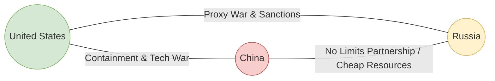

# Great Power Rivalries: The US-China-Russia Strategic Triangle and the Domestic Frontline

This analysis examines the intense tripolar rivalry between the United States, China, and Russia. Beyond the public declarations of defending democracy or national sovereignty, this document explores the hidden strategic and economic motivators of each power. Crucially, it details how these high-stakes geopolitical maneuvers directly impact the wallets, security, and jobs of middle-class Americans.

---

## 1. The Strategic Triangle: Historical Inversion

During the Cold War, U.S. national security advisor Henry Kissinger successfully executed a "triangulation" strategy: opening relations with Beijing to exploit the Sino-Soviet split, thereby isolating the Soviet Union. Today, U.S. foreign policy faces the inverse of this scenario: a deepening, asymmetric Sino-Russian alliance that forces Washington to prepare for a potential two-front conflict.

---

## 2. The U.S.-China Rivalry: Hegemonic Tech and Supply Chain War

The competition with the People’s Republic of China (PRC) is the defining geopolitical struggle of the 21st century. It is not an ideological clash, but a systemic struggle for dominance over the technological and financial architectures of the future.

### Hidden Motivators
*   **Preventing a Peer Competitor:** The primary U.S. goal is to maintain absolute technological supremacy (AI, quantum computing, biotechnology, and advanced manufacturing). Under the "foreign direct product rule" and export controls, the U.S. seeks to choke off China's access to advanced chips, preventing Beijing from achieving dominance in autonomous weapons and commercial tech sectors.
*   **Preserving the Dollar Cleared Network:** China’s expansion of the Cross-Border Interbank Payment System (CIPS) and the promotion of the Petroyuan aim to build a shadow financial system immune to U.S. Treasury sanctions. The U.S. seeks to lock global trade into dollar clearance to preserve its sanction leverage.
*   **Corporate Profit Protection:** Bipartisan policy is heavily influenced by domestic tech giants and defense firms lobbying to protect intellectual property from Chinese state-sponsored cyber-espionage and forced technology transfers.

### Direct Impacts on the American Middle Class
*   **Domestic Inflation & Consumer Costs:** Decoupling (or "de-risking") from Chinese supply chains raises the cost of manufacturing. While tariffs protect domestic industries, they also raise retail prices on basic consumer goods—from laptops and smartphones to home appliances—acting as a flat tax on middle-class budgets.
*   **Critical Supply Chain Vulnerabilities:** Despite efforts to reshore, the U.S. middle class remains highly dependent on China for critical goods. Over 70% of Active Pharmaceutical Ingredients (APIs) used in U.S. generic drugs are manufactured in China or India (which relies on Chinese raw materials). In a conflict over Taiwan, access to life-saving medications (antibiotics, heart pressure medications) would be immediately severed.
*   **Squeezing the Labor Market:** While tech containment protects intellectual property, it also leads to retaliatory measures from Beijing (e.g., banning Micron chips or restricting critical minerals like gallium and germanium). This directly impacts jobs in U.S. semiconductor assembly and automotive plants that rely on these inputs.
*   **Espionage and Subversion:** Chinese intelligence operations increasingly target U.S. academic institutions, research labs, and state local governments. This intellectual theft drains innovation, reducing the long-term competitiveness of U.S. industries and the high-paying R&D jobs available to American graduates.

---

## 3. The U.S.-Russia Rivalry: Attrition, NATO, and Energy Geopolitics

The invasion of Ukraine in 2022 marked the definitive end of the post-Cold War expansion phase. The resulting proxy war between the U.S. and Russia is driven by deeply entrenched security and resource motivators.

### Hidden Motivators
*   **Degrading a Rival cheaply:** For U.S. planners, supporting Ukraine is a low-cost method to severely degrade Russia’s conventional military capabilities, exhaust its treasury, and tie down its forces, without putting American boots on the ground.
*   **European Energy Dependency Shift:** A primary geopolitical victory for the U.S. was the destruction of the Nord Stream pipelines and the subsequent embargo on Russian gas. This severed Germany and Western Europe from cheap Russian energy, forcing Europe to import expensive U.S. Liquefied Natural Gas (LNG) and lock in long-term supply contracts, securing U.S. economic leverage over the continent.
*   **Defense Procurement Expansion:** The war in Ukraine has triggered a massive expansion of U.S. defense procurement. The billions of dollars in "aid" sent to Ukraine are largely spent domestically, buying new munitions and weapons systems from U.S. defense contractors to replace stockpiles.

### Direct Impacts on the American Middle Class
*   **Fiscal Crowd-Out and Debt Expansion:** The hundreds of billions of dollars allocated to foreign military aid directly expand the U.S. national debt. Middle-class taxpayers shoulder the future interest burden of this debt, while domestic public investments in deteriorating infrastructure (highways, water systems, power grids) are deprioritized.
*   **Energy Shocks & Utility Costs:** Sanctions on Russian oil and gas disrupted global energy markets. Although the U.S. is a major oil producer, oil is priced globally. Middle-class families faced sharp spikes in home heating oil, natural gas, and gasoline prices, which cascaded into broader transportation-driven inflation on groceries and consumer services.
*   **The Threat of Conscription and Escalation:** As conventional Ukrainian forces face manpower shortages, the risk of direct NATO-Russia escalation rises. For middle-class families, the ultimate risk is the potential reactivation of the Selective Service System (the draft) or mobilization of National Guard units for a major foreign conflict.

---

## 4. The Asymmetric Sino-Russian Alliance: U.S. Vulnerabilities

The "no limits" partnership signed between Xi Jinping and Vladimir Putin in 2022 is a marriage of strategic convenience, but it poses a unique structural challenge to U.S. power.

### Hidden Dynamics
*   **Resource and Technology Exchange:** Sanctioned by the West, Russia has pivoted its massive energy exports to China at steep discounts, providing Beijing with energy security in the event of a U.S. maritime blockade. In return, China supplies Russia with dual-use technology (microchips, machine tools, drone components) that sustains Russia's military-industrial complex.
*   **Strategic Distraction:** The alliance coordinates diplomatic and military pressure. Russian naval maneuvers in the Mediterranean or Arctic, combined with Chinese pressure on Taiwan and the South China Sea, force the U.S. to divide its naval and intelligence resources, weakening its deterrence capacity in both theaters.

### Domestic Vulnerabilities
*   **The Threat to the Dollar Security Umbrella:** If Russia and China successfully build a non-dollar trading bloc that incorporates major oil producers (like Saudi Arabia or the UAE), the demand for the U.S. dollar will drop significantly. If the U.S. loses its "exorbitant privilege" of printing money to cover its debts, interest rates on mortgages, car loans, and credit cards for middle-class Americans will skyrocket, triggering a severe domestic standard-of-living crisis.
*   **Cyber Warfare & Infrastructure Threats:** Adversarial state actors (such as China's "Volt Typhoon" and Russian state-backed hacking groups) have actively infiltrated U.S. critical infrastructure, including municipal water systems, electrical grids, and oil pipelines (e.g., the Colonial Pipeline hack). In a geopolitical crisis, these hidden implants could be triggered, directly disrupting the daily lives, safety, and utilities of millions of American citizens.
