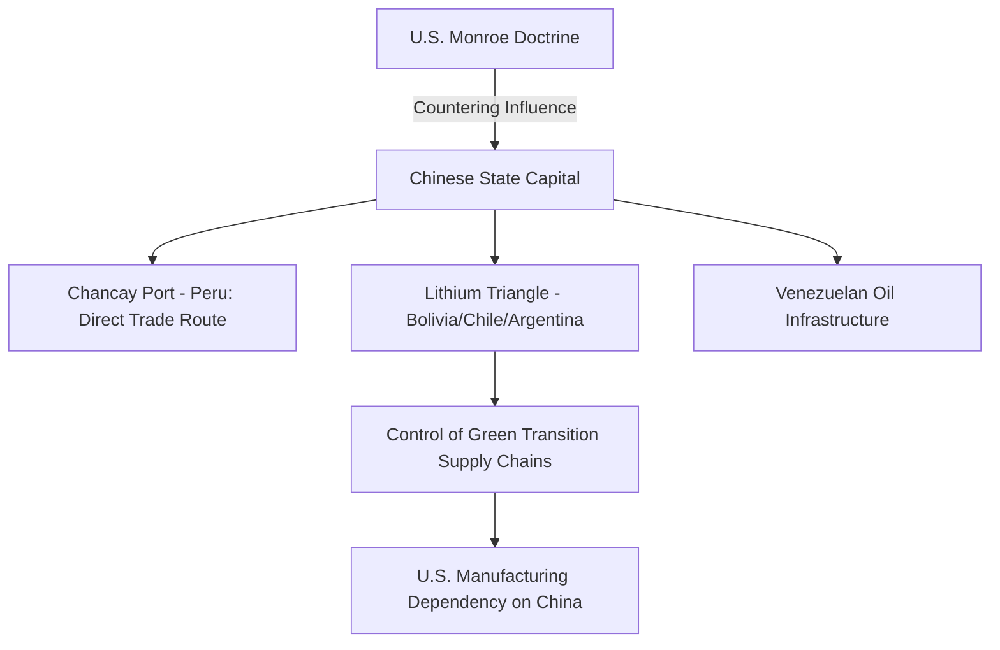

# Hemispheric Security & Transnational Threat Flows: Latin America, Cuba, and the Drug Trade on the Domestic Frontline

This analysis evaluates the security dynamics of the Western Hemisphere (the U.S. "near-abroad") and the flows of transnational threats that cross its borders. Moving past public rhetoric regarding democratic values and humanitarian aid, we analyze the hidden motivators behind Cuban intelligence operations, the geopolitical scramble for South American minerals, and the weaponization of the fentanyl supply chain. Crucially, we document how these hemispheric policies directly impact middle-class Americans through public safety, local municipal tax burdens, wages, and the opioid crisis.

---

## 1. Cuba: The Adversarial Listening Post in the Caribbean

Cuba remains a highly strategic node for U.S. adversaries due to its proximity (90 miles) to the U.S. mainland.

### Hidden Motivators
*   **The Asymmetric Counter-weight:** For Beijing and Moscow, establishing intelligence-gathering and military footprints in Cuba is a direct counter-weight to U.S. forward deployments near their borders (e.g., U.S. forces in Japan/Taiwan and NATO deployments in Eastern Europe). It signals that the Western Hemisphere is no longer an exclusive U.S. sphere of influence (the Monroe Doctrine).
*   **Chinese Signals Intelligence (SIGINT):** China has established and expanded electronic listening posts in Cuba (such as facilities at Bejucal, Wajay, and Calabazar). These facilities intercept electronic communications, satellite data, and military transmissions from U.S. bases in the Southeast (e.g., CENTCOM in Tampa, military test ranges in Florida).
*   **Russian Port Access:** Russia utilizes Cuba for naval port calls (including deployments of nuclear-powered submarines like the *Kazan* and frigates armed with hypersonic missiles). This provides Moscow with a platform to project power directly off the U.S. Atlantic coast during geopolitical crises.
*   **U.S. Embargo as Domestic Leverage:** While the U.S. maintains embargo sanctions on Cuba under the guise of promoting democracy, the hidden motivator is domestic electoral politics. Maintaining a hardline stance on Cuba is critical for winning Florida's electoral votes, where the Cuban-American exile demographic is highly politically active and influential.

---

## 2. South America: The Resource Scramble and the Belt & Road

South America has become a primary battlefield in the geopolitical competition for resource dominance between the United States and China.

### Hidden Motivators
*   **The Lithium Triangle:** Chile, Argentina, and Bolivia hold over 50% of the world's known lithium reserves. China's state-owned enterprises have systematically bought up mining concessions, processing facilities, and joint ventures in this region. The motivator is to secure a monopoly on the supply chains for electric vehicle batteries and grid storage, locking the West into dependence on Chinese-processed minerals.
*   **The Chancay Port Megaproject:** In Peru, China has built the deep-water megaport of Chancay. By bypassing North American ports, this facility creates a direct shipping pipeline from South America to Shanghai. For Beijing, this locks in agricultural and mineral flows and establishes a dual-use port infrastructure that could support the Chinese Navy in the Pacific.
*   **Venezuela oil and debt:** Despite heavy U.S. sanctions, Venezuela continues to export oil. While the U.S. periodically relaxes sanctions to allow Chevron to extract oil (seeking to lower domestic gas prices), Venezuela remains heavily dependent on China and Russia, who hold massive debt-for-oil arrangements and utilize Caracas as an anti-U.S. diplomatic base in South America.

---

## 3. The Drug Trade: The Fentanyl Supply Chain as Asymmetric Warfare

The illicit drug trade is no longer just a law enforcement issue; it has evolved into a strategic national security threat. The fentanyl epidemic is the result of a transnational supply chain that bridges East Asian chemical manufacturing and Central American trafficking syndicates.

### The Transnational Supply Chain
1.  **Chemical Precursors (China):** Chinese chemical manufacturers produce the precursor chemicals required to synthesize fentanyl. These chemicals are shipped—often using mislabeled cargo manifests and shell companies—to Mexican ports.
2.  **Synthesis and Pressing (Mexico):** Two dominant Mexican cartels—the Sinaloa Cartel and the Jalisco New Generation Cartel (CJNG)—receive these precursors, process them into fentanyl in clandestine labs, and press them into counterfeit prescription pills (oxycodone, Adderall, Xanax) or mix them into heroin and cocaine.
3.  **Trafficking (U.S. Southern Border):** The cartels smuggle the finished product across the U.S. southern border, primarily through official Ports of Entry hidden inside commercial vehicles or carried by couriers.

### The Hidden Geopolitical Motivator
*   **Asymmetric Warfare/State Inaction:** Multiple U.S. intelligence briefings indicate that Beijing deliberately turns a blind eye to the export of fentanyl precursors. By refusing to crack down on these chemical companies, China uses the flow of fentanyl as geopolitical leverage. During trade and technology negotiations with Washington, Beijing treats cooperation on narcotics enforcement as a bargaining chip, using U.S. addiction rates as a lever of pressure to extract concessions.

---

## 4. Direct Impacts on the American Middle Class

The combination of hemispheric instability, uncontrolled border flows, and the drug trade directly damages the safety, economic status, and fiscal health of the American middle class.

### The Opioid Epidemic: Gutting the Workforce
*   **Human Toll:** Fentanyl poisoning is the leading cause of death for Americans aged 18 to 45, causing over 70,000 fatal overdoses annually. The epidemic disproportionately targets middle-class and working-class families in suburban, rural, and industrial communities.
*   **Economic Drain:** The loss of prime-age workers reduces domestic labor productivity and places an immense fiscal burden on the healthcare system. The annual economic cost of the opioid crisis in the U.S. is estimated at over $1.5 trillion, covering healthcare, criminal justice, lost productivity, and social services. This cost is funded through increased health insurance premiums and higher state and federal taxes on middle-class taxpayers.

### Municipal Fiscal Strains and Local Tax Spikes
*   **Border Failures and Local Costs:** Uncontrolled border flows place direct strains on municipal infrastructures across the U.S., not just in border states. Cities and suburban counties are forced to allocate local tax revenues to fund emergency housing, public school expansions (to accommodate non-English speaking students), and public hospital emergency rooms (which are legally mandated to treat all patients regardless of legal status).
*   **Local Tax Spikes:** Because local governments must balance their budgets, the rising cost of social services and emergency healthcare directly triggers spikes in local property taxes. Middle-class homeowners pay higher property taxes, which in turn drives up rent costs and reduces household disposable income.

### Wage Compression and Labor Market Pressures
*   **Depressing Blue-Collar Wages:** The influx of millions of low-wage undocumented workers expands the supply of informal labor. This suppresses wages in key middle-class and entry-level industries, particularly in construction, landscaping, agriculture, and hospitality. 
*   **Erosion of Labor Standards:** Employers utilizing undocumented labor can bypass U.S. minimum wage laws, safety regulations, and payroll taxes. This creates an uneven playing field, making it difficult for law-abiding American citizens and legal immigrants to secure fair wages or find stable employment in these sectors.

### Transnational Crime and Domestic Safety
*   **Cartel Infiltration:** Mexican cartels have established distribution networks inside major U.S. cities and suburbs (e.g., Atlanta, Chicago, Denver). The expansion of these networks has brought violent gang rivalries, carjackings, and retail theft syndicates directly into American communities, degrading the public safety and property values of middle-class neighborhoods.
*   **Law Enforcement Overrun:** Local police departments are forced to pivot their limited budgets and manpower toward drug interdiction, overdose responses, and cartel-linked crime, reducing their capacity to police domestic property crimes, traffic safety, and neighborhood security.
