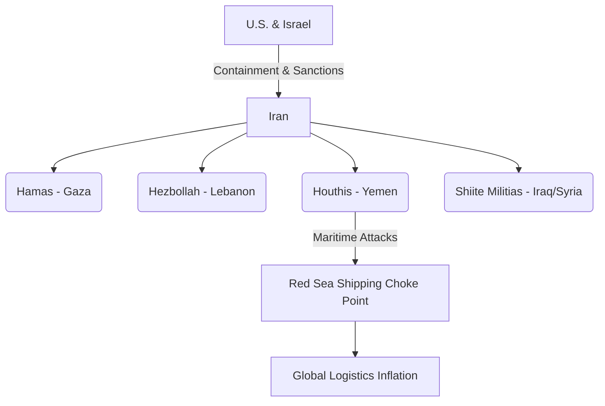

# Middle East Geopolitics: Israel, the Iran Proxy Network, and the Domestic Cost of Hegemony

This analysis examines U.S. foreign policy in the Middle East, with a specific focus on the strategic partnership with Israel and the containment of Iran's proxy network. Beyond the standard diplomatic talking points of historical alliances and democracy-building, we dissect the hidden motivators driving these policies. We trace the direct economic, fiscal, and social impacts of Middle Eastern instability and U.S. military commitments on the lives of middle-class Americans.

---

## 1. Israel as the Geopolitical Anchor of U.S. Influence

The relationship between the United States and Israel is unique in modern diplomacy, characterized by deep military, intelligence, and financial integration.

### Hidden Motivators
*   **The Offshore Intelligence/Security Hub:** For U.S. realists, Israel is a highly capable, pro-Western military force positioned in the heart of the Levant. It serves as a critical intelligence-sharing hub, testing ground for advanced American weaponry (e.g., F-35s, Iron Dome integration), and a bulwark against hostile regional regimes (Syria, Iran) and non-state actors.
*   **Domestic Political and Financial Influence:** U.S. support for Israel is heavily shaped by domestic lobbying. Organizations like AIPAC (American Israel Public Affairs Committee) hold significant influence over both political parties. Furthermore, the evangelical Christian voting base in the U.S., a critical demographic for the Republican Party, views support for Israel as a core theological and political priority.
*   **Military-Industrial Subsidization:** The billions in Foreign Military Financing (FMF) that the U.S. provides to Israel annually are not cash transfers; they are structural vouchers. Under U.S. law, Israel is required to spend the vast majority of this aid purchasing hardware directly from U.S. defense contractors (Lockheed Martin, Boeing, RTX). Thus, U.S. aid to Israel is a hidden subsidy for the domestic defense-industrial complex, maintaining factory jobs in key congressional districts while locking Israel into long-term dependency on U.S. supply chains.

---

## 2. The Iran Threat and the "Axis of Resistance"

U.S. Middle East strategy is structured around the containment of the Islamic Republic of Iran and its asymmetric proxy network, known as the "Axis of Resistance."

### Hidden Motivators
*   **Petrodollar Reciprocity and Arms Markets:** Containment of Iran is essential to maintain security guarantees for the Gulf Cooperation Council (GCC) monarchies, particularly Saudi Arabia. In exchange for U.S. security guarantees against Iran, these nations price their oil exports in U.S. dollars (the petrodollar system) and reinvest their sovereign wealth back into U.S. Treasury bonds.
*   **Weaponizing Regional Cleavages:** Keeping Iran isolated justifies the sale of hundreds of billions of dollars in advanced weaponry to Saudi Arabia and the UAE. This regional arms race keeps the U.S. defense sector highly profitable.

---

## 3. Realpolitik vs. America First in the Middle East

The debate over U.S. Middle East policy reveals a sharp divide in strategic approach between globalist realists and nationalist reformers.

### The Realpolitik Approach: Active Management
*   **Strategy:** Continuous diplomatic engagement, troop deployments across permanent bases (Kuwait, Bahrain, Qatar, Djibouti), and military intervention to enforce regional stability and secure global oil maritime transit.
*   **Assumption:** Any vacuum left by a U.S. withdrawal will immediately be filled by China (which is brokering diplomatic deals like the Saudi-Iran normalization) or Russia (which maintains military bases in Syria).

### The America First Approach: Offshore Balancing & Burden-Sharing
*   **Strategy:** Retrenchment from "forever wars," reducing direct military presence, and demanding that local allies form their own coalition to contain common threats. This approach was the driving force behind the **Abraham Accords**, which sought to normalize relations between Israel and Arab states (UAE, Bahrain, Morocco), establishing a regional anti-Iran coalition that does not rely on direct U.S. troop deployments.
*   **Assumption:** The U.S. is now energy independent (due to domestic shale oil/fracking) and should not spend blood and treasure policing trade routes for East Asian consumers (like China and Japan) who are the primary buyers of Persian Gulf oil.

---

## 4. Direct Impacts on the American Middle Class

Middle-class Americans are the primary underwriters and casualties of Middle East instability.

### Economic and Energy Transmission Channels
*   **Energy Prices & Gasoline Inflation:** Despite U.S. energy self-sufficiency, oil is a fungible global commodity. Any escalation in the Middle East (such as threats to the Strait of Hormuz or drone strikes on Saudi infrastructure) instantly drives up global crude prices. For a middle-class American family, a $1.00 spike at the pump acts as an immediate drain on disposable income, increasing the costs of commuting, shipping, and food.
*   **Logistical Inflation (The Red Sea Crisis):** Houthi missile and drone attacks in the Bab-el-Mandeb strait forced container ships to bypass the Suez Canal, routing around the Horn of Africa. This added 10-14 days to shipping times, drove up fuel costs, and spiked maritime insurance premiums. These logistical overheads are passed directly to American consumers in the form of higher retail prices on imported clothing, auto parts, and appliances.

### Fiscal & Security Burdens
*   **Sunk Capital:** The post-9/11 wars in Iraq, Afghanistan, and Syria cost U.S. taxpayers over $8 trillion. This massive capital outflow did not create domestic wealth; it expanded the national debt. Middle-class citizens bear the burden of paying down this debt, which limits the government's fiscal capacity to invest in domestic manufacturing, infrastructure, or tax relief.
*   **Domestic Terrorism and the Police State:** U.S. military interventions in the Middle East have historically provoked retaliatory radicalism. The cost of countering this threat has resulted in a massive expansion of the domestic security apparatus (DHS, TSA, NSA surveillance). Middle-class Americans pay for this through both taxes and the erosion of civil liberties, undergoing intrusive surveillance and security bottlenecks in daily life.

### Societal & Institutional Polarization
*   **Cultural Friction:** Foreign policy disputes in the Middle East flow directly into domestic American institutions—particularly elite universities, media organizations, and corporate boards. The intense polarization over the Israeli-Palestinian conflict has fueled domestic cultural division. Middle-class families watching these conflicts play out in public spaces see academic institutions and corporate HR departments prioritizing foreign political causes over domestic education, basic safety, and equal opportunity, leading to growing domestic resentment against the political establishment.
