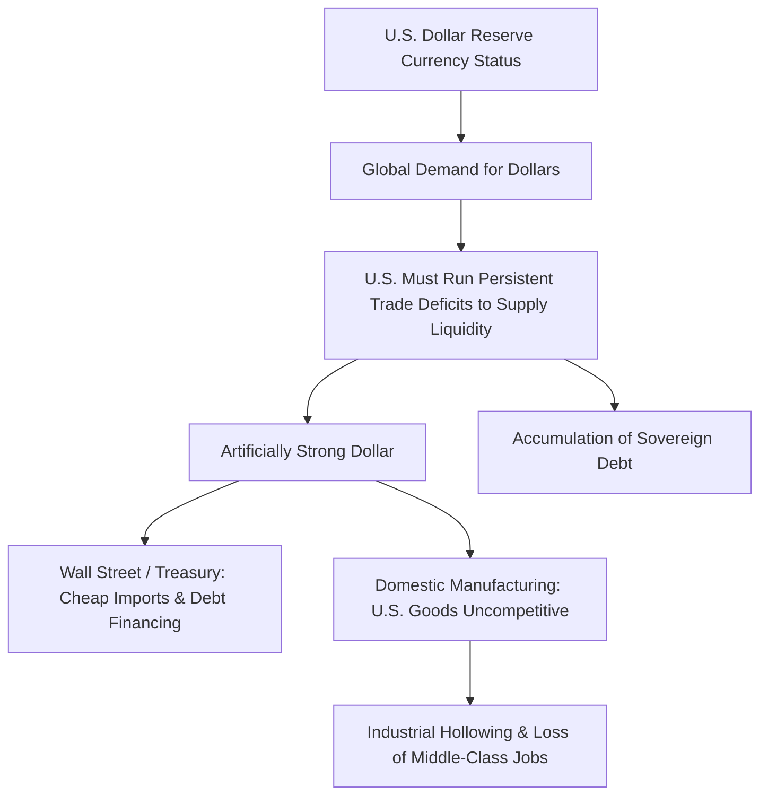

# Realpolitik vs. America First: Geopolitical Alignment, Divergence, and the Impact on the Middle Class

This analysis explores the systemic divergence and convergence between two dominant schools of thought in modern American foreign policy: traditional **Realpolitik** (classical/structural realism) and the contemporary **"America First"** doctrine (economic nationalism and transactional realism). By looking beyond the public statements of officials, we examine the hidden economic, structural, and domestic motivators that drive these paradigms and trace their direct impacts on the economic security and cultural status of the American middle class.

---

## 1. Theoretical Foundations & Hidden Motivators

### Realpolitik: The Structural Balance of Power
Traditional Realpolitik operates on the assumption of international anarchy where sovereign states are the primary actors, motivated by security, power, and survival. 
*   **The Public Narrative:** U.S. foreign policy is framed as a defense of the "rules-based international order," promoting human rights, democracy, and freedom of navigation.
*   **The Hidden Motivator:** Structural realism seeks to prevent any single rival from achieving regional hegemony (particularly in Eurasia). The United States maintains a sprawling global network of military bases, bilateral security treaties, and multilateral alliances (such as NATO) not out of altruism, but to institutionalize American dominance, project power directly to the borders of adversaries, and lock allies into dependencies on the American security umbrella, financial systems, and defense industries.
*   **Key Actors:** The foreign policy establishment ("the Blob"), defense contractors (Lockheed Martin, Raytheon), intelligence agencies, and globalist think tanks.

### America First: Transactional Nationalism
The "America First" doctrine represents a shift toward a populist, nationalist realism. It rejects the assumption that maintaining global stability through costly alliances and foreign interventions is in the interest of the American public.
*   **The Public Narrative:** Reclaiming national sovereignty, stopping "forever wars," securing borders, and demanding that allies pay their "fair share" for defense.
*   **The Hidden Motivator:** A reaction against the negative domestic externalities of globalization. It recognizes that the costs of maintaining global hegemony (military spending, trade deficits, offshoring of manufacturing) are disproportionately borne by the American middle and working classes, while the benefits accrue to multinational corporations, financial institutions, and political elites. It views international agreements and organizations (UN, WTO, WHO) not as neutral arbiters, but as vehicles that restrict American sovereignty and facilitate the rise of foreign competitors like China.
*   **Key Actors:** Domestic manufacturers, trade nationalists, border-security advocates, and the populist working-class electorate.

---

## 2. U.S. Dollar Hegemony & The Triffin Dilemma

The U.S. dollar's role as the global reserve currency is the linchpin of American global hegemony, but it creates a structural conflict of interest between global managers and the domestic middle class.

### The Geopolitical Utility of the Dollar (The Realpolitik Perspective)
For the national security establishment, the reserve currency status of the dollar is a weapon of unmatched power. 
*   **Exorbitant Privilege:** It allows the United States to print money to finance massive federal budget and trade deficits, essentially borrowing from the rest of the world at low interest rates to fund its military projection and domestic consumption.
*   **Financial Coercion:** Because global oil and commodity trades are cleared in dollars through the SWIFT messaging system, the U.S. can cut off adversaries (e.g., Iran, Russia) from the international financial system. This financial blockade is often more effective than traditional military blockades.

### The Domestic Toll: The Triffin Dilemma (The America First Perspective)
The **Triffin Dilemma** dictates that to supply the world with reserve currency, the reserve country must run persistent trade deficits. This has direct, negative consequences for the American middle class:
*   **Overvalued Currency:** Global demand for dollars keeps the exchange rate artificially high. While this makes foreign-made consumer goods cheap for American shoppers, it makes American-made exports expensive and uncompetitive globally.
*   **Decimating the Industrial Core:** An artificially strong dollar acts as a structural tax on domestic manufacturing. It incentivizes corporations to shut down American factories and relocate production to countries with weaker currencies and lower costs (such as China or Mexico).
*   **Asset Bubbles and Financialization:** The influx of foreign capital returning to buy U.S. Treasury bills and real estate inflates asset prices. This benefits owners of financial assets (Wall Street, the upper class) but drives up housing costs for the middle class, widening wealth inequality.

---

## 3. Offshoring vs. Reshoring: The Battle for Manufacturing

The shift from domestic industrialization to globalized supply chains represents one of the most significant foreign policy choices of the post-Cold War era, driven by hidden corporate motivators and justified by geopolitical theories.

| Feature | Offshoring (Globalist Realpolitik / Neoliberalism) | Reshoring (Economic Nationalism / America First) |
| :--- | :--- | :--- |
| **Primary Motivator** | Corporate profit optimization & integration of rivals (e.g., China) | National self-reliance, security of supply chains, and domestic employment |
| **View on Trade** | Free trade, low tariffs, global supply chains | Strategic tariffs, border protection, domestic supply chains |
| **Domestic Impact** | Hollowing of industrial communities, lower consumer prices | Rebuilding manufacturing, higher wages, potential inflation |
| **Security Risk** | Critical dependencies on adversaries (pharmaceuticals, semiconductors) | High transition costs, potential retaliatory trade wars |

### The Corporate-Geopolitical Alliance (Offshoring Motivators)
For decades, the bipartisan Washington consensus advocated for free-trade agreements (like NAFTA and China's accession to the WTO).
*   **The Hidden Motivator:** Corporate lobbying. Multinational corporations sought access to cheap foreign labor markets to maximize profit margins and return on equity, while financial institutions facilitated these cross-border capital flows. 
*   **The Geopolitical Justification:** The "liberal integration" theory assumed that by integrating China into the global trading system, Beijing would inevitably liberalize politically and become a "responsible stakeholder" in the U.S.-led order. This proved to be a catastrophic miscalculation, as China utilized its trade surplus to modernize its military and challenge U.S. hegemony.

### The Rise of Industrial Nationalism (Reshoring Motivators)
The "America First" movement reframed manufacturing not merely as an economic sector, but as a critical pillar of national security.
*   **Loss of Strategic Autonomy:** The COVID-19 pandemic and rising tensions with China revealed that the U.S. could no longer manufacture basic antibiotics, personal protective equipment, steel, or advanced microchips. In a conflict scenario, this dependence is a severe vulnerability.
*   **Rebuilding the Middle Class:** Manufacturing jobs traditionally provided solid, middle-class wages, health insurance, and pensions for workers without college degrees. The loss of these jobs gutted the social fabric of the American heartland, leading to a rise in deaths of despair (addiction, suicide) and the hollowing out of municipal tax bases, which in turn degraded schools, infrastructure, and public safety.
*   **Tariffs as a Weapon:** The use of targeted and broad-based tariffs seeks to raise the cost of imported goods, neutralizing the artificial currency and labor advantages of foreign rivals and forcing corporations to invest in domestic production.

---

## 4. Cultural and Ideological Dimensions of Foreign Policy

Foreign policy is not merely about military deployments and trade balances; it is also an export of ideological and cultural values. The tension between the globalist establishment and the nationalist middle class manifests in distinct cultural conflicts.

### The Export of Progressive Neoliberalism
In the modern era, the U.S. state department, foreign-funded NGOs, and international organizations have increasingly tied aid, diplomatic support, and trade relationships to the adoption of progressive social values (gender policies, LGBTQ+ rights, diversity, equity, and inclusion initiatives).
*   **The Realpolitik Angle:** Promoting these values serves to brand the United States as a moral leader, projecting "soft power" to contrast with the authoritarian, socially conservative regimes of Russia and China. It also serves as a ideological wedge to challenge traditionalist power structures in developing nations, making them more receptive to Western institutional influence.
*   **The Nationalist Backlash:** Critics of this policy argue that the U.S. government is spending public funds to export cultural values that do not represent a large portion of the American middle class. This leads to a perception that foreign policy elites are more aligned with global corporate diversity policies than with the traditional cultural fabric of the nation.

### Demographic Realities and Domestic Friction
Globalist economic policies naturally favor the free movement of labor alongside capital.
*   **The Labor Supply Motivator:** Large corporations and agricultural lobbies benefit from a continuous influx of low-skilled foreign labor, which depresses wages in sectors like construction, service, and agriculture, keeping corporate profit margins high.
*   **The Middle-Class Impact:** While elites benefit from cheap domestic services, middle-class and working-class communities face increased competition for entry-level jobs, wage stagnation, and severe strains on public infrastructure (schools, healthcare, housing).
*   **Anti-White Discrimination and Elite Rhetoric:** Within corporate and academic institutions aligned with globalist governance, diversity and equity programs have frequently adopted frameworks that categorize the traditional white working-class majority as "privileged," despite this demographic suffering the brunt of the industrial hollowing, the opioid crisis, and economic stagnation. This has fueled significant domestic resentment, with working-class Americans arguing that elites prioritize globalist diversity metrics and foreign aid over the economic and civil rights of citizens at home.

---

> [!NOTE]
> **Summary Paradox**: Traditional Realpolitik secured U.S. global hegemony through dollar dominance and global alliances, but in doing so, it created economic and cultural conditions that hollowed out the very middle class required to sustain that hegemony over the long term. The "America First" doctrine seeks to reverse this dynamic by subordinating global dominance to domestic economic restoration, presenting a fundamental challenge to the post-Cold War geopolitical consensus.
